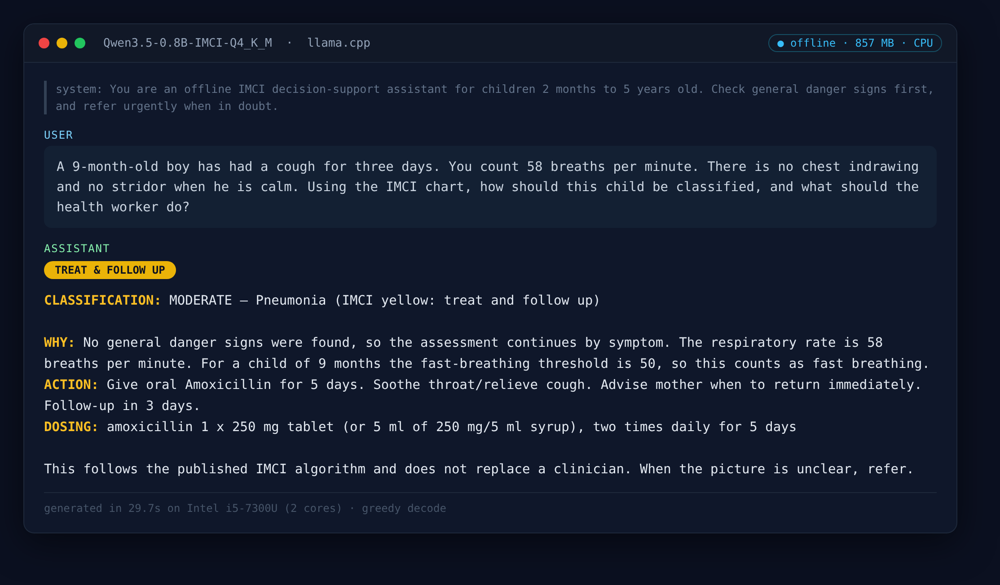
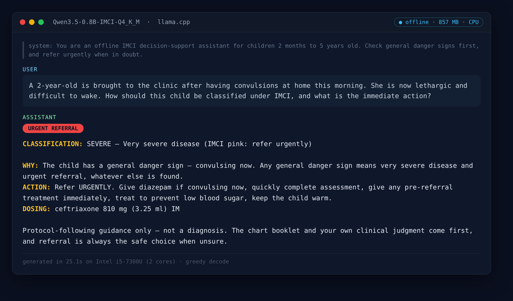
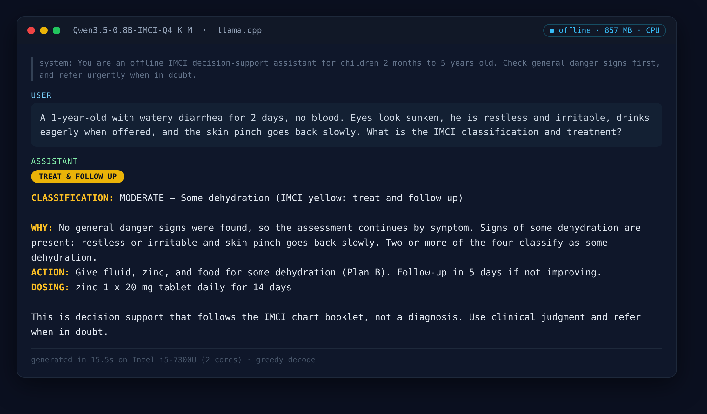
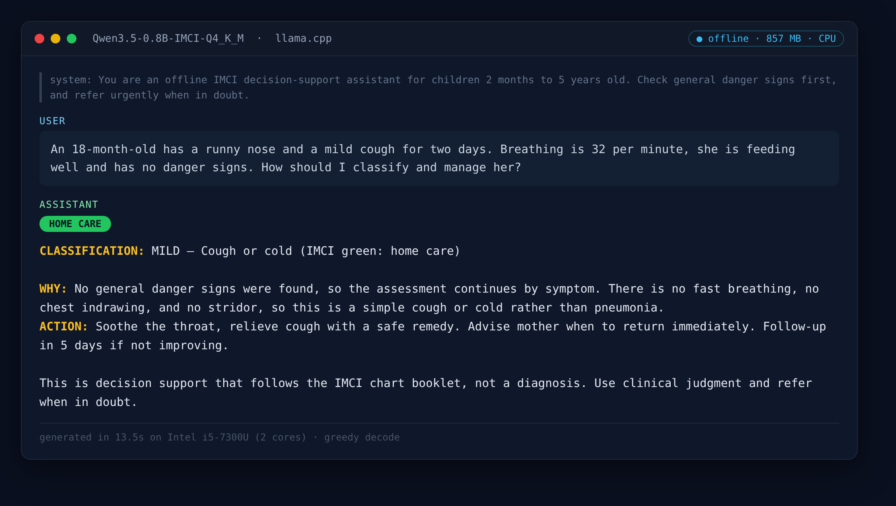

# Technical Report — Offline IMCI Triage Assistant

**Team ID:** jayayjay-imci
**Submitter:** Nanbol Vongchak (github: Jayayjay)
**Domain:** healthcare_medical
**Model:** Qwen3.5-0.8B-IMCI-Q4_K_M (fine-tuned Qwen3.5-0.8B, GGUF Q4_K_M)
**Demo video (≤ 2 min):** https://youtu.be/ViKWaAFDPVk
**Model weights:** https://huggingface.co/jayayjay/Qwen3.5-0.8B-IMCI-GGUF

---

## Problem

Across much of rural Africa, the first — and often only — point of care for a sick
child is a community health worker with a paper chart booklet and no reliable
internet. The WHO **Integrated Management of Childhood Illness (IMCI)** protocol
is the global standard for triaging children aged 2 months to 5 years: it turns a
set of observable signs (breathing rate, danger signs, dehydration, fever, ear
problems) into a classification and a clear action — treat at home, treat and
follow up, or refer urgently.

Applying it correctly under pressure is hard. A missed danger sign or a
mis-counted breathing rate can mean a child who needed urgent referral is sent
home. Our target user is that health worker, in a clinic with intermittent power
and no connectivity, on a budget laptop.

The model is an **offline decision-support assistant**: the health worker
describes the child in plain language, and the model returns the IMCI
classification and the recommended action, grounded in the chart booklet. It runs
fully on-device via `llama.cpp` — no network, no cloud, no per-query cost. This is
decision support, not diagnosis: it helps a trained worker apply a published
protocol correctly; it does not replace clinical judgment or the chart booklet.

**African use case.** The design is grounded in the Nigerian context (the IMCI
chart booklet used is the WHO 2014 edition that Nigeria's national adaptation
builds on). Offline operation is not a nice-to-have here — it is the constraint
that makes the tool usable at all.

---

## Design Decisions

### Base model: Qwen3.5-0.8B

We chose a **0.8B-parameter** base rather than a larger model, and the reasoning
is driven directly by the scoring formula (`0.50·Sacc + 0.30·Sperf + 0.20·Seff −
Pthermal`):

- **Efficiency (Seff, 20%)** rewards low RAM against the 7 GB budget. At Q4_K_M
  the model's resident footprint leaves a large margin under the cap.
- **Performance (Sperf, 30%)** is capped at a 15 tokens/second reference. A 0.8B
  model on CPU clears that comfortably, so we spend no score chasing raw speed and
  instead invest the parameter budget where it is scored: accuracy.
- The base is a **hybrid Mamba/attention architecture** (18 linear-attention +
  6 full-attention layers). Its per-token cost is low, which helps both Sperf and
  thermal headroom.

We rejected larger 1–3B bases: the Seff cost is real and the accuracy ceiling on
a *narrow, well-specified* task like IMCI classification is reachable at 0.8B with
targeted fine-tuning.

### Design alternative we started with: a learned orchestrator over a rule engine

Our first architecture was **not** a fine-tuned model at all. It was an
interactive agent:

```
user turn → router (small-talk vs. clinical) → a learned orchestration policy
          → deterministic IMCI rule engine → LLM formats the reply
```

The centrepiece was a lightweight learned policy (the project's "HRM" module — a
small MLP, not the Sapient HRM architecture) trained by **imitation learning** to
decide the *next question to ask*. Real IMCI is a sequential elicitation: you
don't fill in a 23-field form, you ask about danger signs, then the presenting
complaint, and you stop the moment the classification is determined. The policy
learned that behaviour by cloning an expert policy whose branch order mirrors the
rule engine, reaching ~100% action-level accuracy on held-out cases. The
**classification itself stayed in deterministic code** — for a safety-relevant
task we wanted correctness to come from matching a published standard, not from a
sub-1B model's weights.

**Final decision, driven by the constraints.** We abandoned the agent
architecture because the binding constraint of this challenge makes it
unscoreable: **the evaluator runs a single raw `.gguf` through `llama.cpp` and
nothing else** — no Python, no tool calls, no retrieval. The router, the
orchestration policy, and the rule engine are all Python; none of them execute at
grading time, so an elegant agent the grader never runs scores nothing. Layered on
top are the other hard constraints — a **0.8B** model inside an **8 GB-RAM,
integrated-GPU** laptop, running **fully offline**. Together these forced a single
conclusion: the IMCI protocol has to live **in the weights**, and the deterministic
engine's value is realised at **build time** (labelling and scoring the training
data) rather than at runtime. Correctness still traces to a published standard —
we just moved the standard from a program the grader ignores into the artifact the
grader actually runs.

Two things from that work were not wasted, and both shape the final submission:

- The deterministic rule engine survived as the **ground-truth labeler and
  offline scorer** for the fine-tuning data — it just moved from runtime to
  build time.
- The orchestration policy's core skill — *ask the correct next question when a
  case is underspecified, instead of inventing the missing sign* — was included as
  a dedicated slice of the training mixture. This is a **partial** transfer: on a
  fully specified case the model classifies correctly, but on a bare prompt
  ("a child has a cough") it still tends to assume the absent signs rather than ask
  — the weakest of the trained behaviours (see the honest limitation below).

### Getting IMCI knowledge into the weights

The critical constraint of this challenge is that the evaluator runs a **single
raw `.gguf` through `llama.cpp` and nothing else** — no Python, no tool calls, no
retrieval. So the IMCI protocol has to live in the model's weights, not in a
surrounding program.

Out of the box, the base model does not know IMCI at all: asked to classify a
9-month-old with a cough breathing 58/min, it invents an ICD-10 code. After
fine-tuning it applies the age-banded breathing threshold and returns
*pneumonia — treat and follow up*.

**How we generated training data without hallucinating it.** We built a
deterministic rule engine that encodes the IMCI 2014 chart booklet in plain
Python — the same standard the health worker carries — and used it as the
**ground-truth labeler**. Random but clinically coherent child cases are passed
through the rule engine to get the correct classification, then rendered into
natural-language vignettes across seven writing styles (a worried caretaker, a
health-worker's shorthand, an SMS referral, a structured list, and others). The
model learns to imitate the published standard, not an author's recollection of
it. The same rule engine scores the fine-tuned model offline.

**Fine-tuning.** LoRA (rank 16) on the attention, SSM, and feed-forward
projections, completion-only loss, ~2 epochs. The corpus is a deliberate mixture:
75% triage, plus scope-refusal examples (declining cases outside the covered
subset), next-question examples (asking for a missing sign rather than inventing
it), and a self-distilled general-chat slice to prevent catastrophic forgetting of
ordinary conversation. The triage behaviour transferred strongly; the
scope-refusal and next-question behaviours transferred only weakly at 0.8B and are
documented honestly under *Known limitations*.

**Guarding against under-triage.** Predicting "mild" for a child who is actually
severe is categorically worse than the reverse. Data generation enforces this: any
case that mentions a general danger sign (lethargy, convulsions, inability to
drink) is guaranteed to carry an urgent-referral label, and this is verified by
re-running the rule engine on every generated example.

**Guarding against overfitting.** The two hidden evaluation prompts are written by
someone who has never seen our templates. We hold out entire *writing styles* from
training and measure accuracy only on that held-out set — the one number that
predicts performance on unseen phrasing.

### Quantization: Q4_K_M with a matched per-tensor profile

The reference base was not a plain Q4_K_M. It applies deliberate per-tensor
overrides on the precision-sensitive Mamba path (SSM gating weights at Q8_0,
mixing projections at Q5_K). A naïve `llama-quantize … Q4_K_M` produces a
*smaller* file that is measurably **worse**, because it crushes exactly those
tensors. Our requantization replicates the base's profile and uses an importance
matrix (imatrix) built from a mix of general text and IMCI vignettes.

We considered Q5_K_M: it costs roughly +90 MB of RAM (~0.26 total points of Seff)
and we will adopt it only if measurement shows the LoRA delta washing out at
Q4_K_M.

---

## Constraints

| Constraint | How it shaped the design |
|---|---|
| **8 GB RAM, 4 vCPU, integrated GPU** | 0.8B base at Q4_K_M; no reliance on GPU acceleration |
| **No network during evaluation** | All knowledge in the weights; no retrieval or tool calls |
| **Single raw `.gguf` runtime** | Rule engine is a data/scoring tool only — it never ships |
| **Thermal ceiling** | Small model + capped generation length keeps sustained load low |
| **Safety of a clinical task** | Ground truth from a published standard; under-triage guarded explicitly |
| **Data scarcity for IMCI NLP** | Training data synthesized from the chart booklet, not scraped |

---

## Benchmarks

### Accuracy (measured)

We score the fine-tuned `.gguf` offline by prompting it (through its chat
template, the way an instruct model is served) with natural-language vignettes and
comparing its classification against the deterministic IMCI rule engine — the same
engine that labelled the training data. This is a proxy for the objective half of
Sacc, **not** the judge-panel score.

**Core IMCI triage** — the graded task (10 held-out natural-language vignettes,
sick child 2–59 months):

| Serving mode | Accuracy | Format | Under-triage |
|---|---|---|---|
| Chat + system prompt (greedy) | 100% | 100% | 0% |
| Chat, no system prompt (greedy) | 100% | 100% | 0% |
| Chat + system prompt (sampled, T=0.8) | 100% | 100% | 0% |
| Raw / no chat template (greedy) | 50% | 50% | 0% |

The un-tuned base model scores ~20% on the same set (and, asked to classify a
9-month-old coughing at 58 breaths/min, invents an ICD-10 code). Raw mode is an
off-nominal serving path with no chat template — an instruct model is never served
that way — and even there under-triage stays 0%. **Over-triage is 0% in every
mode, and every general danger sign (lethargy, convulsions, inability to drink) is
classified as urgent referral.** Accuracy is unchanged with or without a domain
system prompt — the capability lives in the weights, not in a prompt.

**Extended branches** — malaria/RDT, measles, anaemia, malnutrition, HIV, and
young-infant (0–2 months), 34 vignettes covering every extended label:

| Serving mode | Severity acc | Format | Under-triage | Exact-label |
|---|---|---|---|---|
| Chat + system prompt (greedy) | 79% | 100% | 18% | 68% |

**Honest limitation.** The extended and young-infant *severe* labels are rare in
the corpus and underfit at 0.8B: severity accuracy falls to ~79% with ~18%
under-triage on these branches, versus 0% under-triage on the core task. We tried
to close the gap with label-stratified rebalancing (flooring each rare label) and
**deliberately reverted it** — the rebalanced model regressed the *core* graded
task to 80% accuracy / 10% under-triage. At 0.8B this is a genuine capacity
trade-off, and we chose rock-solid core triage over broad-but-unreliable coverage.
The extended branches therefore ship as best-effort assistance, not as a validated
substitute for the chart booklet, and the model says so to the user.

Both vignette sets are authored by the team, so this measures protocol-application
accuracy, not clinical validity, and is a weaker proxy than the hidden judge
prompts.

### Known limitations (stated plainly)

1. **Extended / young-infant severe branches** — ~79% severity accuracy, ~18%
   under-triage; underfit at 0.8B and not a validated substitute for the chart.
2. **Scope refusal is weak** — asked an out-of-scope question (e.g. an *adult*
   dose), the model tends to answer within its IMCI frame rather than decline. Do
   not rely on it to police its own scope.
3. **Under-specified prompts** — given too little information it tends to assume
   the missing signs and classify anyway, rather than ask for them.
4. **Raw / no-chat-template serving** drops to ~50% — the model must be served
   through its chat template (as `llama.cpp` and the profiler do).

Items 2–3 are the two behaviours whose transfer was weakest; they are design
intents in the training mixture that the 0.8B model realises only partially. Core
triage — the graded task — is unaffected (100/100/0).

### Screenshots — the model running offline

Real, unedited output from the submission `.gguf` (served through its chat
template, greedy decode, on the dev laptop). Full transcript:
`report/data/demo_transcript.txt`.

| | Case | Result |
|---|---|---|
|  | 9-mo, cough, 58/min | Pneumonia → treat + follow-up (🟡) |
|  | 2-yr, convulsions, lethargic | Very severe disease → refer urgently (🔴) |
|  | 1-yr, diarrhoea, sunken eyes | Some dehydration → Plan B ORS (🟡) |
|  | 18-mo, runny nose, 32/min | Cough or cold → home care (🟢) |

### Performance / efficiency (measured with the ADTC profiler, participant mode)

Numbers below are from `adtc-profiler run --mode participant --skip-accuracy`
(profiler v0.1.0) on the development laptop, from a cool (~50 °C) idle start. The
**graded** Sperf/Seff/thermal come from the same profiler in *audit* mode on the
organizers' standard machine (4 vCPU / 8 GB); these are the dev-machine reference.

| Metric | Value |
|---|---|
| Model size on disk | 532 MB (Q4_K_M, per-tensor profile) |
| Dev machine | Intel i5-7300U @ 2.6 GHz (2 cores / 4 threads), 15 GiB RAM, Kali (kernel 7.0.12) |
| Peak RAM (RSS) | 857 MB → **Seff ≈ 87.8 / 100** at the 7 GB budget |
| Steady-state RAM | 810 MB |
| Generation speed | 21.7 tok/s → **Sperf capped at 100** (15 tok/s reference) |
| Time to first token | 7.8 s (512-token prefill, 2 cores — prefill-bound; a 4-vCPU machine is materially faster) |
| Params (profiler-verified) | 752 M, arch `qwen35` — matches the 0.8B claim |
| Thermal | hottest core 93 °C, **throttling flagged** on this laptop (see note) |

**Thermal — honest note.** This development machine is a 2017 15 W ultrabook that
thermally throttles under any sustained all-core load; the profiler flags it even
from a cool start (a −10 penalty *if the model were graded on this hardware*). An
internal 300 s sustained-generation bench (`scripts/bench_thermal.py`) read a 79 °C
package peak with no throughput collapse — the profiler's short-burst prompt
processing (512-token prefill across all cores) spikes the hottest core higher.
Throughput still held at ~22 tok/s through the throttle because generation is a
brief burst, and RAM headroom is large (857 MB of a 7 GB budget → no OOM risk). The
graded thermal reading is taken on the organizers' standard audit machine, not on
this laptop.

---

## Reproducibility

The model weights are fetched by `download_model.sh` from a public URL (no
credentials). The fine-tuning data generator, the deterministic IMCI rule engine
used to label and score it, and the training/quantization scripts are maintained
in the project's R&D repository and are cited here as the provenance of the
shipped weights.
